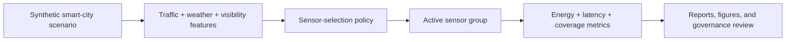

<p align="center">
  
</p>

<h1 align="center">Adaptive Sensor Selection in Smart Cities</h1>

<p align="center">
  <b>A research-grade AIoT smart-city lab for dynamic sensor group selection, energy-efficient traffic monitoring, low-latency response, and safety-aware urban sensing.</b>
</p>

<p align="center">
  <a href="../../actions/workflows/python-checks.yml"></a>
  
  
  
  
  
</p>

---

## Overview

**Adaptive Sensor Selection in Smart Cities** is an independent academic research prototype for studying how AIoT systems can dynamically choose the right sensor group for urban traffic monitoring. The project focuses on **energy efficiency**, **real-time response latency**, **traffic safety**, **visibility-aware sensing**, and **transparent sensor-selection logic**.

The original dataset idea supports the study **“Adaptive AIoT Framework with Dynamic Sensor Group Selection for Real-Time Traffic Monitoring and Energy Efficiency.”** This repository now also includes a polished research README, reproducibility guidance, a baseline Python runner, visual documentation, governance notes, and citation metadata.

The core idea is simple: instead of turning on every sensor all the time, a smart-city system should activate the sensor group that best fits the current traffic, weather, visibility, and safety context.

> **Research boundary:** This repository uses synthetic data and synthetic decision-support baselines. It is not official city infrastructure software, traffic-signal control software, surveillance software, emergency response software, or deployable public safety equipment.

<p align="center">
  
</p>

---

## Research objective

Can adaptive sensor group selection reduce energy consumption and response latency while preserving enough sensing coverage for traffic-monitoring and safety-aware smart-city scenarios?

| Research question | Evidence generated locally |
|---|---|
| Which sensor groups fit different traffic and weather conditions? | Scenario-level sensor-selection table |
| Can adaptive selection reduce energy use? | Energy-consumption comparison and active-sensor count |
| Does lower energy create latency or safety trade-offs? | Response-latency and coverage/safety proxy review |
| Which features drive sensor decisions? | Time, traffic density, weather, visibility, and derived risk signals |
| Can a simple model learn the selection policy? | Decision-tree baseline and prediction table |
| Can experiments remain reproducible? | Fixed seed, CSV outputs, report, and GitHub Actions smoke test |

---

## Architecture



<p align="center">
  
</p>

The workflow is intentionally transparent and lightweight. It is designed for research, teaching, and experimentation before any real sensor or city data is introduced.

---

## Dataset concept

The synthetic dataset represents smart-city traffic-monitoring scenarios with different combinations of traffic, weather, visibility, and time-of-day conditions.

| Feature | Meaning |
|---|---|
| `Scenario_ID` | Unique synthetic scenario identifier |
| `Time_of_Day` | Encoded time period such as night, morning, afternoon, or evening |
| `Traffic_Density` | Synthetic vehicle-density signal |
| `Weather_Condition` | Encoded condition such as clear, rain, fog, or storm |
| `Visibility` | Synthetic visibility score |
| `Optimal_Sensors` | Encoded active sensor group |
| `Energy_Consumption` | Estimated energy use for the selected group |
| `Response_Latency` | Expected response latency in milliseconds |

### Scenarios covered

1. Clear weather with low traffic.
2. Foggy conditions with high traffic.
3. Night-time with varying visibility.
4. High-density traffic in rain.
5. Sparse traffic with clear weather.
6. Rush hour with medium visibility.
7. Extreme weather with low visibility.
8. Peak traffic during daylight.
9. Off-peak hours with good weather.
10. Holiday traffic with mixed weather conditions.

---

## Core capabilities

| Capability | What it does | Why it matters |
|---|---|---|
| Synthetic scenario modeling | Simulates traffic, weather, visibility, energy, and latency signals | Enables safe experiments without real city sensor data |
| Adaptive sensor selection | Chooses sensor groups based on context | Reduces unnecessary always-on sensing |
| Energy-latency evaluation | Measures how choices affect power and response time | Makes trade-offs visible |
| Safety-aware review | Tracks visibility and traffic density when reducing sensors | Helps prevent blind energy optimization |
| Explainable baseline | Uses a decision-tree classifier for transparent policy learning | Makes decisions easier to inspect |
| Research governance | Documents non-deployment boundaries | Avoids overstating synthetic results |
| Reproducible workflow | Fixed seed, CSV outputs, report, and CI smoke test | Supports academic use and extension |

---

## Run today

Install dependencies:

```bash
python -m pip install -r requirements.txt
```

Run the synthetic baseline:

```bash
python scripts/run_sensor_selection_baseline.py --samples 1000 --seed 42
```

Windows quick start:

```bat
cd %USERPROFILE%\-Adaptive-Sensor-Selection-in-Smart-Cities
git pull

py -m venv .venv
.venv\Scripts\activate

python -m pip install --upgrade pip
python -m pip install -r requirements.txt
python scripts\run_sensor_selection_baseline.py --samples 1000 --seed 42
```

---

## Generated local outputs

```text
outputs/results/synthetic_sensor_scenarios.csv
outputs/results/sensor_selection_predictions.csv
outputs/results/sensor_selection_metrics.csv
outputs/reports/sensor_selection_report.md
```

The outputs are generated locally and should be treated as synthetic research artifacts only.

---

## Example usage

```python
import pandas as pd
from sklearn.tree import DecisionTreeClassifier
from sklearn.model_selection import train_test_split

# After running the baseline script:
data = pd.read_csv("outputs/results/synthetic_sensor_scenarios.csv")

X = data[["Time_of_Day", "Traffic_Density", "Weather_Condition", "Visibility"]]
y = data["Optimal_Sensors"]

X_train, X_test, y_train, y_test = train_test_split(
    X, y, test_size=0.25, random_state=42
)

clf = DecisionTreeClassifier(max_depth=6, random_state=42)
clf.fit(X_train, y_train)
print("Model accuracy:", clf.score(X_test, y_test))
```

---

## Evaluation metrics

| Metric | Meaning | Boundary |
|---|---|---|
| Prediction accuracy | Whether a model predicts the encoded sensor group | Synthetic labels only |
| Mean energy | Average energy use of selected sensors | Proxy, not hardware measurement |
| Mean latency | Average response delay | Proxy, not real network latency |
| Active-sensor count | Number of sensors turned on per scenario | Useful for energy trade-off review |
| Scenario performance | Metrics grouped by traffic, weather, and visibility | Synthetic scenario analysis only |
| Safety proxy | Checks whether high-risk scenarios retain enough sensing | Review signal, not safety certification |

---

## Responsible smart-city boundary

This repository is for research, teaching, and synthetic experimentation. Real-world deployment would require calibrated sensor hardware, city data governance, privacy review, cybersecurity review, environmental validation, accessibility review, safety engineering, community consultation, and human oversight.

The system should never be used as the sole basis for traffic control, public warnings, emergency routing, policing, surveillance, road closures, enforcement, or official city policy decisions.

---

## Repository map

```text
.
├── assets/
│   ├── banner.svg
│   ├── sensor-dashboard.svg
│   └── adaptive-workflow.svg
├── docs/
│   ├── governance-and-ethics.md
│   ├── reproducibility-playbook.md
│   └── publication-readiness-plan.md
├── scripts/
│   └── run_sensor_selection_baseline.py
├── outputs/                       Generated locally, not committed by default
├── requirements.txt
├── CITATION.cff
├── LICENSE
└── README.md
```

---

## Documentation

- [`docs/governance-and-ethics.md`](docs/governance-and-ethics.md): responsible AIoT and smart-city deployment boundaries.
- [`docs/reproducibility-playbook.md`](docs/reproducibility-playbook.md): run records, metrics, and interpretation rules.
- [`docs/publication-readiness-plan.md`](docs/publication-readiness-plan.md): academic framing and possible paper structure.

---

## Future extensions

| Extension | Requirement before claiming results |
|---|---|
| Real smart-city sensor data | Privacy review, licensing, city approval, and calibration details |
| Hardware energy benchmarking | Sensor model, power profile, sampling rate, and validation procedure |
| Real-time edge deployment | Latency measurement, cybersecurity review, and fail-safe behavior |
| Multi-objective optimization | Explicit energy-latency-safety objective and ablation study |
| Equity-aware sensing | Neighborhood-level service-quality audit and community review |
| Digital twin integration | Scenario calibration and transport-engineering validation |

---

## Limitations

- Synthetic data validates pipeline behavior, not real city performance.
- Energy and latency are transparent proxies, not hardware measurements.
- Sensor labels are simplified and may not match real sensor-fusion requirements.
- Model accuracy is not equivalent to operational safety.
- Real deployments require formal governance, validation, and human oversight.

## License

Released under the [MIT License](LICENSE). Synthetic examples are provided for research and education only.
