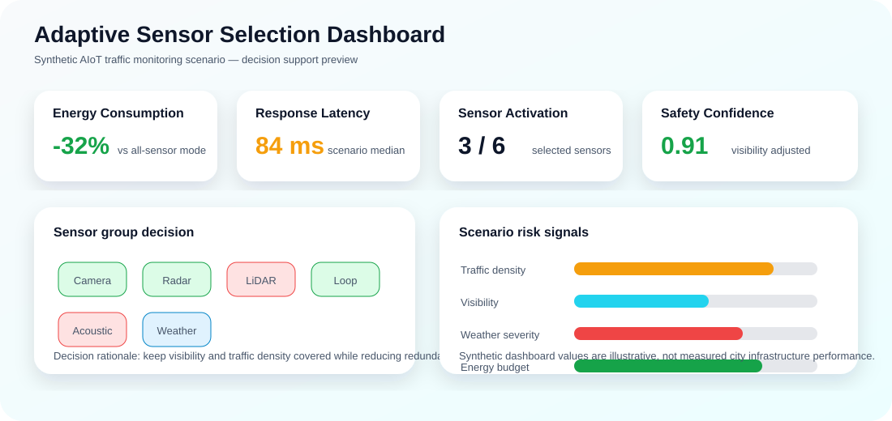
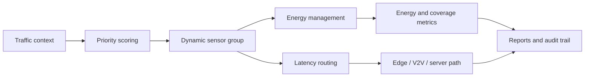
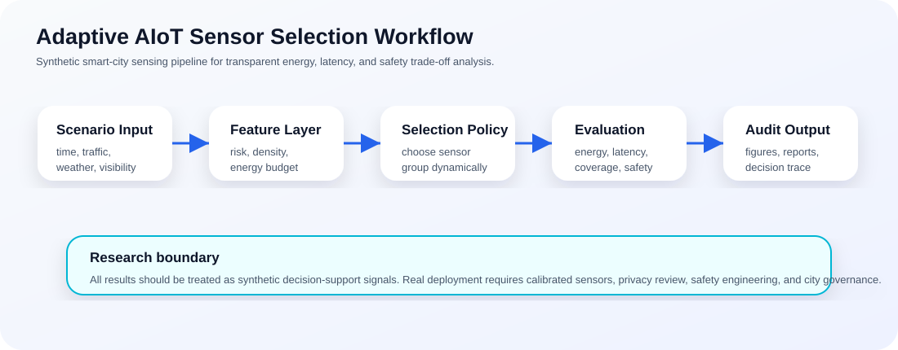
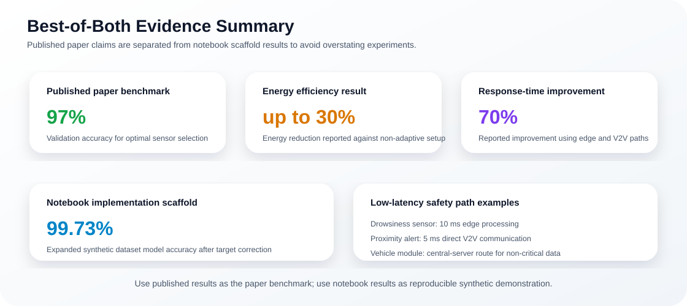

<p align="center">
  
</p>

<h1 align="center">Adaptive Sensor Selection in Smart Cities</h1>

<p align="center">
  <b>Adaptive AIoT framework for dynamic sensor group selection, real-time traffic monitoring, energy-efficient sensing, edge/V2V latency reduction, and smart-city safety research.</b>
</p>

<p align="center">
  <a href="../../actions/workflows/python-checks.yml"></a>
  
  
  
  
  
</p>

---

## Overview

**Adaptive Sensor Selection in Smart Cities** combines the published paper **“Towards Smarter Cities: An Adaptive AIoT Solution with Dynamic Sensor Group Selection for Real-Time Traffic Monitoring and Energy Efficiency”** with the uploaded experimental notebook **`adaptive-sensor-selection-for-smart-cities.ipynb`**.

The repository presents a clean research implementation scaffold for studying how a smart-city AIoT system can activate only the sensors that are relevant to the current traffic, weather, visibility, and time-of-day context. Instead of keeping all sensors active continuously, the framework selects an optimal sensor group, assigns power modes, and routes safety-critical information through low-latency processing paths.

The project focuses on:

- Dynamic sensor group selection for traffic-monitoring scenarios.
- Context-aware sensor priority scoring using time, weather, traffic density, and visibility.
- Energy management through full-power, reduced-power, standby, and duty-cycling behavior.
- Edge processing for time-sensitive sensor events.
- Vehicle-to-vehicle communication for urgent alerts.
- Synthetic dataset generation and decision-tree sensor-selection baselines.
- Reproducible smart-city AIoT experiments with a clear non-deployment boundary.

> **Research boundary:** this repository is a synthetic research and teaching scaffold. It is not traffic-signal control software, surveillance software, public-safety infrastructure, emergency-routing software, or certified smart-city deployment equipment.

<p align="center">
  
</p>

---

## Source basis

| Source | What it contributes to this README |
|---|---|
| Published paper | Formal AIoT framework, dynamic sensor selection method, energy layer, latency layer, experimental tables, and reported performance improvements |
| Uploaded notebook | Executable-style scaffold for dataset generation, model training, real-time prediction, sensor renaming, power allocation, duty cycling, latency simulation, and visual analysis |
| Repository baseline | Lightweight runnable Python script, GitHub Actions smoke test, governance notes, reproducibility notes, and local SVG documentation |

The README separates **published paper results** from **notebook demonstration results** so that the project looks strong without overstating what each source supports.

---

## Published paper

**Title:** Towards Smarter Cities: An Adaptive AIoT Solution with Dynamic Sensor Group Selection for Real-Time Traffic Monitoring and Energy Efficiency  
**Venue:** 2024 10th International Conference on Computer and Communications (ICCC)  
**DOI:** `10.1109/ICCC62609.2024.10941814`  
**Authors:** Hira Khyzer, Yu Zhang, and Rana Muhammad Rashid

The paper proposes an adaptive AIoT framework where traffic-monitoring sensors are selected dynamically according to environmental context. It reports that adaptive sensing can reduce unnecessary sensor usage, conserve energy, and improve response time compared with non-adaptive configurations.

### Main paper contributions

| Contribution | Description |
|---|---|
| Dynamic sensor group selection | Activates sensors only when their contextual priority exceeds a threshold |
| Weighted sensor prioritization | Uses time of day, weather, traffic density, and visibility to compute sensor relevance |
| Energy management layer | Applies full power, reduced power, standby, and duty-cycling logic |
| Latency optimization | Uses edge processing and V2V communication for safety-critical sensor events |
| Smart-city traffic safety framing | Targets adaptive, scalable, energy-aware traffic monitoring in urban environments |

---

## Framework architecture



<p align="center">
  
</p>

The workflow combines the paper’s formal method with the notebook’s executable research path: context input, priority calculation, sensor selection, power allocation, latency handling, and metric reporting.

---

## Core method

### 1. Adaptive sensor group selection

The framework considers a set of available sensors and selects the sensors most relevant to the current traffic context.

| Symbol | Meaning |
|---|---|
| `S` | Set of available sensors |
| `C` | Environmental conditions |
| `T` | Time of day |
| `W` | Weather condition |
| `D` | Traffic density |
| `V` | Visibility |
| `P(si | C)` | Priority score of sensor `si` under context `C` |
| `τ` | Activation threshold |
| `Sopt` | Selected optimal sensor group |

The paper expresses the priority score as a weighted context function:

```text
P(si | C) = w1·T + w2·W + w3·D + w4·V
```

A sensor is selected when its priority score is greater than or equal to the activation threshold.

```text
Sopt = { si ∈ S | P(si | C) ≥ τ }
```

The published paper reports weights of:

```text
w1 = 0.30   time of day
w2 = 0.25   weather
w3 = 0.30   traffic density
w4 = 0.15   visibility
```

### 2. Energy management layer

After sensor selection, the energy layer assigns each sensor to one of three modes.

| Mode | Meaning |
|---|---|
| Full power | Critical sensor needed immediately |
| Reduced power | Useful sensor with moderate priority |
| Standby / duty cycling | Non-critical sensor retained with low activity |

This prevents an always-on sensing strategy and makes energy use responsive to current traffic conditions.

### 3. Latency optimization layer

The paper and notebook both emphasize that not all data should follow the same processing path.

| Processing path | Intended use |
|---|---|
| Edge processing | Local handling of urgent or safety-critical sensor data |
| V2V communication | Direct urgent alerts between vehicles |
| Central server | Non-critical data, long-term analytics, and storage |

The optimized latency path is selected from central processing, edge processing, and V2V communication.

---

## Best-of-both results summary

<p align="center">
  
</p>

| Result area | Published paper | Uploaded notebook |
|---|---:|---:|
| Sensor-selection model accuracy | `97%` validation accuracy | `99.73%` on expanded synthetic dataset scaffold |
| Energy improvement | up to `30%` energy reduction reported overall | synthetic energy monitoring and power allocation demo |
| Response-time improvement | `70%` improvement reported vs. non-adaptive configuration | edge, V2V, and optimized communication simulation |
| Example edge latency | `10 ms` for drowsiness sensor processing | reproduced as local edge-processing example |
| Example V2V latency | `5 ms` for proximity alerts | reproduced as direct V2V urgent-alert example |

**Important interpretation:** the published paper result is the main research benchmark. The notebook result is a reproducible synthetic demonstration scaffold and should not be presented as a separate real-world deployment benchmark.

---

## Experimental design

The paper and notebook follow the same research direction: create a synthetic set of smart-city traffic conditions and use them to learn or evaluate sensor-selection behavior.

### Context variables

| Feature | Description |
|---|---|
| `time_of_day` / `Time_of_Day` | Morning, afternoon, evening, or night context |
| `weather` / `Weather_Condition` | Clear, foggy, rainy, storm-like, or encoded weather condition |
| `traffic_density` / `Traffic_Density` | Low, medium, high, or numerical vehicle-density signal |
| `visibility` / `Visibility` | Visibility value or visibility score |
| `optimal_sensors` / `Optimal_Sensors` | Target sensor group for the context |

### Sensor groups

The notebook maps shorter experimental sensor labels into clearer smart-city names.

| Notebook label | Clear sensor name |
|---|---|
| `eye_blink` | Driver Drowsiness Sensor |
| `alcohol` | Driver Impairment Sensor |
| `ultrasonic` | Proximity Sensor |
| `Li-Fi` | Vehicle Communication Module |

The paper also discusses environmental sensing, proximity sensing, driver drowsiness monitoring, vehicle communication, edge processing, and central-server analysis as parts of the AIoT architecture.

---

## Scenario coverage

The synthetic dataset concept covers ten traffic and environmental conditions.

| # | Scenario |
|---:|---|
| 1 | Clear weather with low traffic |
| 2 | Foggy conditions with high traffic |
| 3 | Night-time with varying visibility |
| 4 | High-density traffic in rain |
| 5 | Sparse traffic with clear weather |
| 6 | Rush hour with medium visibility |
| 7 | Extreme weather with low visibility |
| 8 | Peak traffic during daylight |
| 9 | Off-peak hours with good weather |
| 10 | Holiday traffic with mixed weather conditions |

These scenarios support energy, latency, visibility, and safety trade-off analysis in a controlled synthetic setting.

---

## What the notebook adds

The uploaded notebook provides a practical implementation scaffold around the paper idea.

| Notebook section | Purpose |
|---|---|
| Data collection and preprocessing | Creates synthetic environmental conditions and optimal sensor labels |
| Model training | Uses `DecisionTreeClassifier` and `MultiLabelBinarizer` for sensor-group prediction |
| Expanded dataset generation | Builds a larger synthetic dataset to improve model learning |
| Real-time sensor selection | Predicts the best sensor group for a new traffic/weather/visibility context |
| Sensor renaming | Converts short labels into readable sensor names |
| Dynamic power allocation | Assigns selected sensors to power modes |
| Duty cycling | Simulates reduced activity for non-critical sensors |
| Energy monitoring | Computes total energy for selected configurations |
| Edge and V2V latency simulation | Demonstrates local processing and direct urgent-alert paths |
| Visualizations | Plots selection, energy, latency, performance, and decision process summaries |

---

## Run the repository baseline

Install dependencies:

```bash
python -m pip install -r requirements.txt
```

Run the synthetic baseline:

```bash
python scripts/run_sensor_selection_baseline.py --samples 1000 --seed 42
```

Windows quick start:

```bat
cd %USERPROFILE%\-Adaptive-Sensor-Selection-in-Smart-Cities
git pull

py -m venv .venv
.venv\Scripts\activate

python -m pip install --upgrade pip
python -m pip install -r requirements.txt
python scripts\run_sensor_selection_baseline.py --samples 1000 --seed 42
```

---

## Generated local outputs

```text
outputs/results/synthetic_sensor_scenarios.csv
outputs/results/sensor_selection_predictions.csv
outputs/results/sensor_selection_metrics.csv
outputs/reports/sensor_selection_report.md
```

These outputs are generated locally and should be treated as synthetic research artifacts.

---

## Evaluation metrics

| Metric | Meaning | Boundary |
|---|---|---|
| Sensor-selection accuracy | How often the model predicts the encoded optimal sensor group | Synthetic labels only |
| Energy consumption | Estimated power use under selected configurations | Proxy, not hardware measurement |
| Response latency | Estimated delay under central, edge, or V2V paths | Simulation / paper table value, not live network latency |
| Active sensor count | Number of enabled sensors per scenario | Energy and coverage trade-off signal |
| Scenario performance | Results grouped by weather, traffic, visibility, and time | Synthetic scenario analysis |
| Safety coverage proxy | Whether high-risk contexts retain sufficient sensing | Review signal, not safety certification |

---

## Example usage

```python
import pandas as pd
from sklearn.model_selection import train_test_split
from sklearn.tree import DecisionTreeClassifier

# After running the baseline script:
data = pd.read_csv("outputs/results/synthetic_sensor_scenarios.csv")

X = data[["Time_of_Day", "Traffic_Density", "Weather_Condition", "Visibility"]]
y = data["Optimal_Sensors"]

X_train, X_test, y_train, y_test = train_test_split(
    X, y, test_size=0.25, random_state=42
)

clf = DecisionTreeClassifier(max_depth=6, random_state=42)
clf.fit(X_train, y_train)
print("Model accuracy:", clf.score(X_test, y_test))
```

---

## Repository map

```text
.
├── assets/
│   ├── banner.svg
│   ├── sensor-dashboard.svg
│   ├── adaptive-workflow.svg
│   └── paper-results.svg
├── docs/
│   ├── governance-and-ethics.md
│   ├── reproducibility-playbook.md
│   └── publication-readiness-plan.md
├── scripts/
│   └── run_sensor_selection_baseline.py
├── outputs/                       # generated locally, not committed by default
├── requirements.txt
├── CITATION.cff
├── LICENSE
└── README.md
```

---

## Documentation

- [`docs/governance-and-ethics.md`](docs/governance-and-ethics.md): smart-city AIoT safety, privacy, equity, and deployment boundaries.
- [`docs/reproducibility-playbook.md`](docs/reproducibility-playbook.md): run records, metric reporting, and interpretation rules.
- [`docs/publication-readiness-plan.md`](docs/publication-readiness-plan.md): academic framing and future paper-extension ideas.

---

## Responsible smart-city boundary

This repository is for research, teaching, and synthetic experimentation. Real-world deployment would require calibrated sensor hardware, field data validation, city data governance, privacy review, cybersecurity review, environmental validation, accessibility review, safety engineering, community consultation, fail-safe design, and human oversight.

The system should never be used as the sole basis for traffic control, public warnings, emergency routing, policing, surveillance, road closures, enforcement, infrastructure investment, or official city policy decisions.

---

## Future extensions

| Extension | Requirement before claiming results |
|---|---|
| Real smart-city sensor data | Privacy review, city approval, licensing, calibration, and governance |
| Hardware energy benchmarking | Sensor model, sampling rate, power profile, and validation protocol |
| Real-time edge deployment | Measured latency, cybersecurity review, fail-safe behavior, and rollback plan |
| Multi-objective optimization | Explicit energy-latency-safety objective and ablation study |
| Digital twin integration | Calibrated mobility scenario and transport-engineering validation |
| Equity-aware sensing | Neighborhood-level service-quality audit and community review |

---

## Limitations

- The default data and notebook demonstrations are synthetic.
- Paper results should be treated as reported experimental findings, not certification for deployment.
- Notebook accuracy is a synthetic scaffold result and should not be framed as real-world traffic safety performance.
- Energy and latency values are proxies or reported experiment values, not live city measurements.
- Model accuracy is not equivalent to operational safety.
- Real deployments require formal governance, validation, human oversight, and safety engineering.

---

## Citation

When using this repository, cite the published paper:

```bibtex
@inproceedings{khyzer2024adaptiveaiot,
  title     = {Towards Smarter Cities: An Adaptive AIoT Solution with Dynamic Sensor Group Selection for Real-Time Traffic Monitoring and Energy Efficiency},
  author    = {Khyzer, Hira and Zhang, Yu and Rashid, Rana Muhammad},
  booktitle = {2024 10th International Conference on Computer and Communications (ICCC)},
  year      = {2024},
  doi       = {10.1109/ICCC62609.2024.10941814}
}
```

## License

Released under the [MIT License](LICENSE). Synthetic examples are provided for research and education only.
